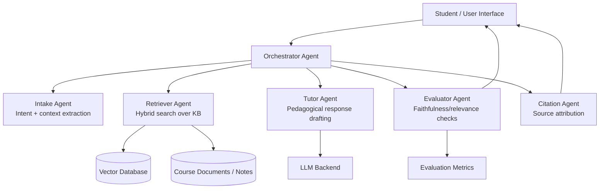

# AI School Website — Multi-Agent RAG Educational Platform


`ai-school-website` is the **canonical repository** for this project.

## Merge Notice

This repository now consolidates work previously split across:

- `fbenkhelifa/ai-school-website` (current canonical repository)
- `fbenkhelifa/alschool` (legacy alias repository)

From now on, all roadmap and implementation references should point to **`ai-school-website`**.

## What is this

AI School Website is an educational AI platform that combines multiple specialized agents with a retrieval-augmented generation (RAG) pipeline to answer learner questions using trusted course knowledge.

## Why it exists

General-purpose chat assistants are often insufficient for coursework support because they may lack domain grounding, consistency checks, and pedagogical adaptation. This platform addresses that with role-based agent orchestration over curated educational sources.

## Architecture / Stack



Planned stack: Python, embeddings + vector retrieval, LLM orchestration, evaluation layer.

## Installation

This repository currently publishes architecture and design artifacts while implementation is being organized for public release.

```bash
git clone https://github.com/fbenkhelifa/ai-school-website.git
cd ai-school-website
cp .env.example .env
```

Set the required credentials in `.env`:

- `ASTRA_BEARER_TOKEN`
- `TOGETHER_API_KEY`
- `SERPER_API_KEY`

## Usage

### Current usage

- Review architecture and product direction in `README.md`
- Read `docs/DESIGN_BRIEF.md` for system-level design goals
- Explore historical coursework artifacts in this repository

### Planned runtime usage (post code release)

- User submits educational question
- Agents retrieve grounded context
- Tutor drafts answer
- Evaluator validates answer quality
- Citation agent attaches references

## Project structure

```text
ai-school-website/
├── README.md
├── .env.example
├── .gitignore
├── LICENSE
├── docs/
│   └── DESIGN_BRIEF.md
├── AISCHOOL/
│   ├── app/
│   ├── config/
│   └── public/
└── AI School Website Project Report.pdf
```

## Legacy artifacts

The following file is preserved as a historical coursework artifact:

- `AI School Website Project Report.pdf`

## Roadmap

1. Publish baseline orchestration + retrieval prototype.
2. Add tutor/evaluator/citation agents with evaluation harness.
3. Add curated educational data ingestion workflow.
4. Publish reproducible local deployment profile.
5. Release benchmark and ablation notes.

## License

MIT License (see `LICENSE`).
